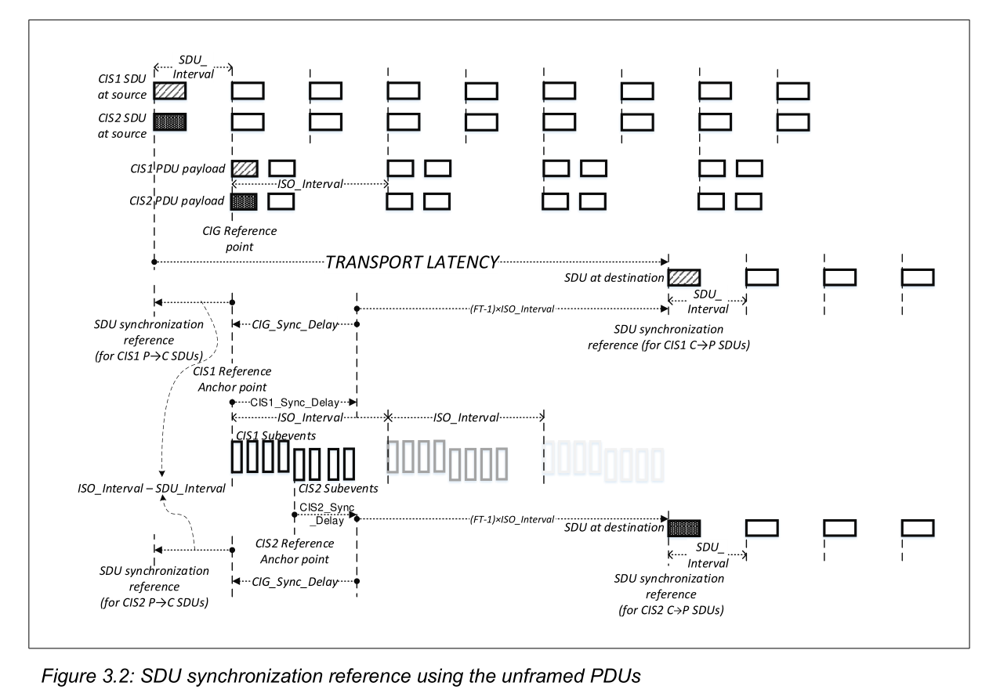

# transport delay



Transport_Latency_C_To_P = CIG_Sync_Delay + (FT_C_To_P – 1) ×ISO_Interval + (USPI_C_To_P – 1) ×SDU_Interval_C_To_P  
  

# 完整推导：$(USPI - 1) \times SDU\_Interval$

## 先定义基础概念（Vol6 Part G）

$$
\boldsymbol{USPI = \frac{ISO\_Interval}{SDU\_Interval}}
$$

> USPI = Number of SDUs Per ISO interval  
> 含义：**一个CIS事件窗口内，最多可以排队发送多少个SDU**  
> 约束：Unframed模式下，ISO_Interval必须是SDU_Interval整数倍，USPI是正整数。

> SDU 规律：上层每隔 `SDU_Interval`​ 产生一帧SDU（音频帧）  
> CIS传输窗口：每隔 `ISO_Interval` 才打开一次射频发包窗口

## 举实例直观理解（核心）

### 示例：

- SDU_Interval = 5 ms（上层每5ms生成1个音频SDU）
- ISO_Interval = 10 ms（链路层每10ms才有一次CIS发包机会）

$$
USPI = 10 / 5 = \boldsymbol{2}
$$

也就是：**一个CIS事件里，可以打包发送2个SDU**

我们按时间线排列SDU生成时刻：

```
t0 → SDU#0 生成
t0+5ms → SDU#1 生成
t0+10ms → CIS事件窗口到来，统一发送 SDU#0 + SDU#1
t0+10ms → SDU#2 生成
t0+15ms → SDU#3 生成
t0+20ms → 下一次CIS窗口发送 SDU#2 + SDU#3
```

现在看**最坏排队时延**：

- SDU#0：生成之后立刻能赶上本次CIS窗口，排队时延 ≈ 0
- SDU#1：生成后还要等待 **5ms** 才等到CIS窗口  
  👉 **最晚生成的那一个SDU，要多等待 1 × SDU_Interval**

$$
(USPI-1)\times SDU\_Interval = (2-1)\times5\mathrm{ms}=5\mathrm{ms}
$$

正好等于这个最大排队时延。

### 再换一组：USPI=3

SDU_Interval=4ms，ISO_Interval=12ms，USPI=3  
SDU序列：#0、#1、#2依次间隔4ms产生，12ms窗口统一发送

- #0：等待0ms
- #1：等待4ms
- #2：等待8ms = $(3-1)\times4$  
  **依然是最晚SDU承受最大缓冲等待。**

## 为什么公式是 `USPI − 1`​，不是 `USPI`？

- 如果USPI=1（标准LC3 10ms场景，ISO=SDU=10ms）  
  $(1-1)\times SDU = 0$，**没有排队延迟**，和工程认知完全吻合。  
  每一个SDU生成刚好对准CIS窗口，不需要攒包。
- 假设写成 `USPI × SDU`，USPI=2时得到10ms，明显不符合时序；  
  最早的SDU不需要等待一整段，只有末尾N-1个SDU存在排队。

## 时序本质（ISOAL Transport Latency定义边界）

Transport Latency 衡量的是：  
**SDU生成参考点 → SDU_Synchronization_Reference（接收端音频对齐基准）的最大时延**

当多个SDU被聚合到同一个CIS事件发送：

1. 最先产生的SDU几乎不需要等待；
2. **最晚产生的SDU必须等待前面全部SDU的生成周期，直到CIS窗口开启；**   
   这一段等待时间就是 $(USPI-1)\times SDU\_Interval$。

> 这一项叫做：**SDU聚合排队时延（SDU accumulation delay）**

## 和另外两项做边界区分（避免混淆）

1. $CIG\_Sync\_Delay$：CIG内部多路CIS时隙偏移，固定硬件调度偏移；
2. $(FT-1)\times ISO\_Interval$：重传失败带来的跨ISO间隔最坏时延；
3. $\boldsymbol{(USPI-1)\times SDU\_Interval}$：**上层SDU生成速率 > CIS发包速率，需要攒多个SDU放到同一个CIS事件引入的排队缓冲时延。**

## 极简总结来源

当链路发包周期（ISO_Interval）慢于音频帧生成周期（SDU_Interval），控制器需要**积攒 USPI 个SDU**，等到CIS窗口一次性发送。  
在同一批打包的SDU中，**最后生成的那一帧SDU需要等待前面 USPI-1 个SDU的生成时长**，这个最大等待时长就是该项。  
标准LE Audio BAP单流场景USPI恒等于1，该项直接归零，所以绝大多数抓包、调试中看不到这个时延分量。

如果你需要，我可以画一张USPI=2的完整时序图，叠加 FT、\(CIG\_Sync\_Delay\)，完整展示整条Transport Latency构成。
