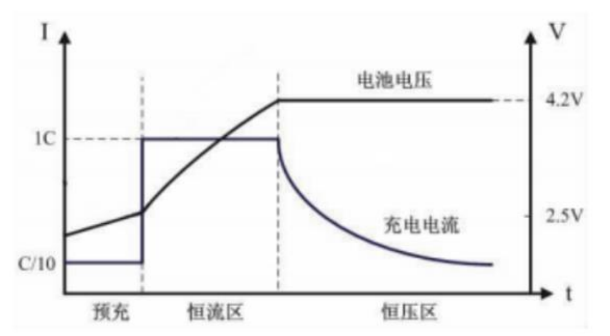

# lx充电体系

# 充电流程：

充电开始过程中，检测电池电压是否大于涓流截止电压（2.9V/3.0V），选择进入涓流或者恒流充阶段，当  
电池电压到达截止电压时，自动切换到恒压充阶段，充电电流逐渐减小，当电流小于截止电流时候，判定  
为充满，停止充电

# 充电调试：

充电问题 debug 过程中可以参考调用 dump_charge 函数，输出充电状态和相关电压检测状态，其中 CHARGE_DC_IN() 用来判定 5V 是否在线，当 VUSB 电压高于电池电压 0.2V 以上，vusb online；CHARGE_INBOX() 用来判定 inbox 电压是否在线，inbox 电压有 1.1 V 和 1.7V 档位可调，当vusb 电压高于 inbox 电压，inbox online；CHARGE_IS_VPEND1() 用来判断充电截止电压是否满足，CHARGE_IS_IPEND() 用来判断充电截止电流是否满足；根据这几个信息可以基本定位芯片充电过程中的状态是否异常

# 充满电唤醒配置：

仓内工作时，无线麦设备正常充满电关机后，需要根据仓的实际电压状态去配置一些唤醒  
源，比如说常规唤醒就是 ==wko 按键唤醒==，也有跟充电仓相关的 ==vusb_wakeup==(5v 唤醒)和 ==inbox wakeup==（0v 唤醒），5v 唤醒就是插入 5v 唤醒无线麦开机，0v 唤醒就是 vusb 掉电掉到 0v 唤醒无线麦开机，一般来说 5v 唤醒用在无线麦入仓充电，0v 唤醒用在无线麦出仓唤醒；注意芯片本身不支持在一边关机一边给唤醒源，关机过程中，如果有对应的唤醒源 pending 过来，会导致整个系统立马 reset，关机失败；所以，配置 vusb 唤醒，需要等待 5V 掉下去之后才能关机，同理，配置 inbox 下降沿唤醒的时候 vusb 端应该有个维持电压

‍
